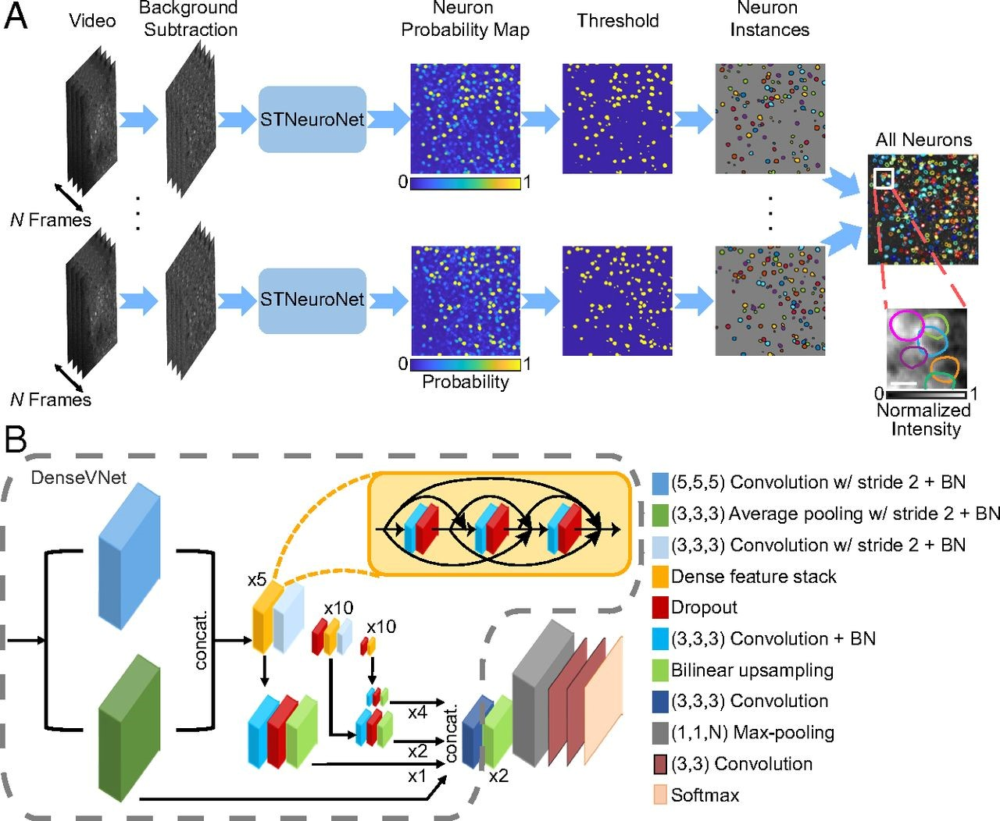

# RCPS-Calcium
## Introduction
Conformal prediction is a relatively new framework for quantifying uncertainty in the predictions made by arbitrary machine learning algorithms. It is a straightforward way to generate prediction sets for any model. Fundamentally, it does so by converting an algorithm’s predictions into prediction sets, which have strong finite-sample coverage properties. At its core, conformal prediction leverages statistical principles to establish a reliable measure of prediction uncertainty.

RCPS (Risk-Controlling Prediction Sets), stemming from conformal prediction, is designed for black-box predictors, reflecting uncertainty by returning a set of responses. This project aims to explore the possibility of directly applying RCPS to calcium imaging data, which are gray-scale images used primarily for recording neural activities.

Deep learning methods for detecting neurons from a video of calcium imaging data capture temporal, spatial, and pixel value information. These methods generate a probability map where each pixel's value represents the probability of belonging to a neuron. A threshold-based predictor is then applied to determine the final prediction set, which contains only the coordinates of pixels predicted to belong to neurons (Fig. 1)(Soltanian-Zadeh et al., 2019). To visualize the results, researchers often plot the coordinates as a binary image or overlay the detected neurons on the raw image.

However, this method is designed for an entire video to capture all the spatial and temporal information required for prediction and cannot be applied to a single frame.

In this project, we propose a method leveraging RCPS. Instead of using machine learning algorithms to first summarize the information in a video or frame and then output the probability map, we directly consider the pixel values after applying the sigmoid function as the probability of belonging to a neuron, similar to the neuron probability map shown in Fig. 1. Although this method ignores spatial pattern and assumes that each pixel's classification is independent of others, it provides an efficient and intuitive way to directly manipulate the raw image, which can be further employed as an input for downstream analysis.
